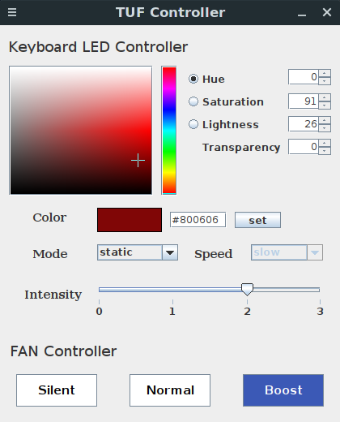
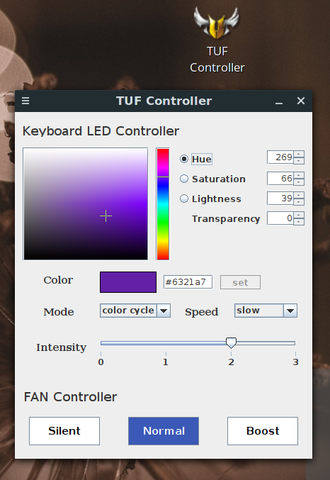

# tuf-controller
A simple GUI made using swing java to change keyboard led color and fan modes in asus TUF series laptop.
###Features:
1. Can instantly change the color of led keyboard upon dragging the color panel.
2. Can change backlit keyboard intensity.
3. Can change FAN modes.

##screenshots:





#Things to do before installing this GUI app
## 1. Install faustus module.
Go to https://github.com/hackbnw/faustus and give this a try. If it doesn't work then try other forks. For my case(FA506II), this fork https://github.com/Hyper-KVM/faustus worked. Thanks to the creater of this project.

## 2. Create a systemd service.
create a file `/etc/systemd/system/faustus_keyboard.service` and put the following lines:
```
[Unit]
Description=Set leds writable to everybody
Before=nodered.service

[Service]
Type=oneshot
User=root
ExecStart=/bin/bash -c "/bin/chmod 777 -R /sys/devices/platform/faustus/*"

[Install]
WantedBy=multi-user.target
```
Then hit following commands:
```
sudo systemctl enable faustus_keyboard
sudo systemctl start faustus_keyboard
```
If this step is skipped, the GUI app needs to be run in super user.

# Installing this app:
This app runs via java-runtime. So java 8 or later must be installed first. Then run the below command:
```
git clone https://github.com/kailasneupane/tuf-controller.git
sudo sh tuf-controller/installer.sh
```
To uninstall:
```
sudo sh tuf-confroller/uninstaller.sh
```
